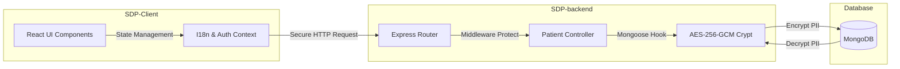

# Rehabilitation & De-addiction Registry System

[](https://nodejs.org/)
[](https://reactjs.org/)
[](https://expressjs.com/)
[](https://www.mongodb.com/)
[](#-security--privacy-engineering)

A secure, offline-first clinical registry system developed for the **Rehabilitation & De-addiction Unit** at **KLE Centenary Charitable Hospital**, Belagavi. The platform is engineered to support clinical staff, counsellors, and administrators in managing patient admissions, building longitudinal psychological histories, tracking recovery milestones via follow-up logging, and exporting clean, range-filtered clinical data.

---

## 🏗️ Architecture Overview

The codebase is split clean into a React frontend client and an Express backend API service:

```
KLE--main/
├── SDP-Client/          # React SPA (Vite/CRA, SCSS, Context-driven I18n)
├── SDP-backend/          # Node.js/Express REST API (Mongoose ODM, AES-256 Crypto)
└── README.md             # Project documentation
```

### System Data Flow


---

## 🛠️ Engineering Decisions & Trade-offs

### 1. Native I18n Engine vs. External Web Widgets
*   **The Problem**: The initial implementation used the external Google Translate widget. In hospital/clinical settings, poor network connectivity or browser privacy extensions (e.g. ad-blockers) blocked the external Google Translate script, rendering language switching useless. In addition, external DOM manipulation by Google Translate frequently conflicts with React's Virtual DOM reconciliation, leading to state desynchronization and client-side crashes.
*   **The Engineering Solution**: We moved to a 100% native context-driven translation dictionary using local key-value files ([translations/index.js](file:///Users/sushant/Desktop/KLE--main/SDP-Client/src/translations/index.js)). We generated **630 translation keys** for English, Kannada (`kn`), and Hindi (`hi`). Translations load instantly in-memory, support offline usage, bypass ad-blockers, and resolve DOM reconciliation errors.

### 2. Application-Level Field Encryption (AES-256-GCM)
*   **The Problem**: Protecting Patient PII (Name, Phone Number, Aadhar Card) is a clinical compliance requirement. Transparent Data Encryption (TDE) at the database layer secures data at rest but does not protect PII in flight or in database dumps.
*   **The Engineering Solution**: Implemented field-level cryptographic hooks inside the Mongoose models. Using the Node `crypto` module, we encrypt sensitive fields during the `pre('save')` lifecycle hook and decrypt them inside `post('init')` using **AES-256-GCM**. This ensures that even if database backups are leaked or accessed by unprivileged DB operations, the patient's identity remains encrypted.

---

## ⚡ Core Capabilities

*   **📋 Narrative Counsellor Sections & Pedigrees**: Custom text areas, detailed pedigree mapping, and automated client validation before final submission.
*   **🛡️ Fail-safe Validation Redirection**: If a user bypasses required fields in Step 1 (via direct tab navigation) and attempts to submit in Step 5, the form intercepts the call, displays a descriptive validation toast, and redirects the viewport to Step 1 while highlighting empty fields.
*   **📅 Range-Filtered Exports**: Live calendar selectors restrict the patient registry list and allow staff to export CSV/Excel sheets filtered by custom time ranges.
*   **🔍 High-Performance Querying**: Real-time patient search filters matching on `name`, `phone`, or encrypted `aadharNumber`.
*   **📈 Follow-Up Logging (Step 6)**: Added schema and component support for logging returning patients (tracking dates, sobriety status, and counsellor notes).

---

## 🚦 Getting Started

### Prerequisites
*   Node.js (>= v16.x.x)
*   npm (>= v8.x.x)
*   MongoDB (>= v5.x.x) local or cloud instance

### 1. Set Up the Backend Service (`SDP-backend/`)
1.  Navigate to the backend directory:
    ```bash
    cd SDP-backend
    ```
2.  Install dependencies:
    ```bash
    npm install
    ```
3.  Create a `.env` file in the root of the `SDP-backend/` directory:
    ```env
    PORT=5001
    MONGO_URI=mongodb://localhost:27017/sdp
    JWT_SECRET=your_super_secure_jwt_secret_phrase
    ENCRYPTION_KEY=64_character_hex_encryption_key
    ```
    > [!TIP]
    > The `ENCRYPTION_KEY` must be exactly 32 bytes represented as a 64-character hex string. You can generate a cryptographically secure key instantly by running:
    > ```bash
    > node -e "console.log(require('crypto').randomBytes(32).toString('hex'))"
    > ```
4.  Seed the database with the default administrator account:
    ```bash
    npm run seed
    ```
5.  Start the development server:
    ```bash
    npm run dev
    ```

### 2. Set Up the Client Application (`SDP-Client/`)
1.  Navigate to the client directory:
    ```bash
    cd ../SDP-Client
    ```
2.  Install dependencies:
    ```bash
    npm install
    ```
3.  Ensure the API routes in [src/utils/apiConstant.js](file:///Users/sushant/Desktop/KLE--main/SDP-Client/src/utils/apiConstant.js) match your backend port configuration (defaults to port `5001`).
4.  Start the local development server:
    ```bash
    npm start
    ```

---

## 🔑 Access Management & Seeded Accounts

Running `npm run seed` populates the database with the default system administrator:

| Role / Panel | Login Username / ID | Password | Description |
| :--- | :--- | :--- | :--- |
| **Administrator** | `admin@admin.com` | `123456` | Full administrative rights, counsellor allocation, system auditing. |

> [!NOTE]
> **Faculty / Counsellor accounts** are created manually via the **Administrator Panel** under the "Manage Faculty" view. Once registered by the administrator, they can log in using their registered email and password to access the patient intake, validation, and follow-up tools.

---

## 🛠️ Production Verification & Bundling

To audit the client codebase and compile the optimized production-ready bundle, execute:
```bash
cd SDP-Client
npm run build
```
This runs the ESLint checks, compiles the JavaScript/SCSS assets, and creates a highly optimized `build/` directory ready for deployment on static hosting platforms.
